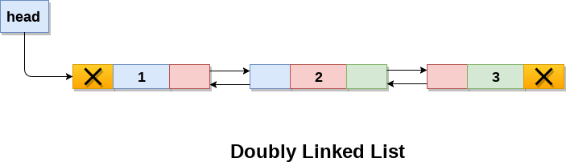
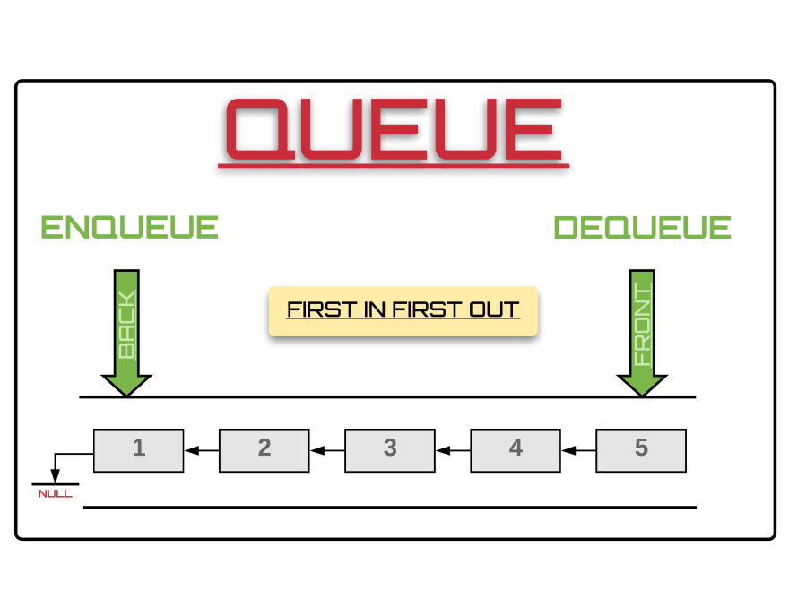

# Data Structures & Algorithm

Data is the quantities, characters or symbols on which operations are performed by a computer, which may be stored and transmitted in the form of electrical signals and recorded on magnetic, optical or mechanical recording media.

## Data structure?
Data structure is the systematic way to organize data so that it can be used efficiently. Efficiency of Data Structure is always measure in term of Time and Space.
There are two types of data structures: Linear and Non-Linear Data Structures.

### Linear Data Structures
A data structure is linear when all the elements are arranged in a linear (sequential) order.  Elements of linear data structures are one-and-each has predecessor and successor except for the Head and The Tail. Example of linear data structure will be: Array, ArrayList, Linked List, Queues and Stacks. 

### Non-Linear Data Structures
A data structure is non-linear when all the elements are not arranged in a linear or sequential order. There is no linear arrangement of elements. Example of non-linear data structure will be Trees and Graphs. 

### Static vs Dynamic Data Structures
#### Static Data Structure
The memory in static data structure is allocated at compile time. Therefore, maximum size is fixed.

**Advantage:** fast access.

**Disadvantage:** Slow insertion and deletion; Good example will be Arrays.

#### Dynamic Data Structure
The memory is allocated at run-time, hence the term "Dynamic". Therefore maximum size is flexible.

**Advantage:** Faster insertion and deletion; 

**Disadvantage:** Slower access; Good example will be Linked List.

## Commonly Used Data Structures
### 1. Linked List
Linked List are collections of data items "linked up in a chain",  insertion and deletion can be made anywhere in a linked list. Linked List are linear collection of self-referential class objects, called nodes, connected through reference links.  Typically a program accesses a linked list via a reference to its first node. The program accesses each subsequent node via the link reference stored in the previous node. 
Data in a Linked List is stored and removed dynamically, the program creates and deletes nodes as necessary.

>**Note:** Stacks and Queues are linear data structures as well.  Trees are non-linear data structures.  Insertion in a Linked List is fast.
Linked List can be maintained in sorted order simply by inserting each new elements at the proper point in the list. See implementation of [Linked List - java package](src/main/java/za/ac/cput/linkedlist) ✍🏾

**Role:** Linked Lists are appropriate when the number of data elements to be represented in the data structure is unpredictable.  Linked List are dynamic compared to conventional Java arrays, so they can increase and decrease as necessary. 

There are three types of Linked Lists, which are:

#### 1.1. Singly Linked List
Linked List nodes normally are not stored contiguously in memory.  Navigation in a singly Linked List is forward only. There is no way of back-tracking.

#### 1.2. Doubly Linked List
In a doubly linked list navigation is both ways (forward and backward).

#### 1.3. Circular Linked List
In a circular Linked List the last element is linked to the first element. 

### 2. Stacks
A Stack is a constrained version of a list. New nodes can be added to or removed from a stack only at the top; for this reason the Stack is referred to as **Last-In and First-Out (LIFO)** data structure. Primary methods for manipulating a stack are push and pop; which add a new node to the top of the stack and remove a node from the top of the stack.

Stack are important in compilers and operating systems; insertion and deletion are made only at one-end of a stack, its top.  Stack data structure is used to implement redo and undo feature. Good example will be of Microsoft Word Undo and redo operations. See implementation of [Stack - java package](src/main/java/za/ac/cput/stacks)

### 3. Queues 
Queues are typically a **first-in, first-out (FIFO)** collection that models a waiting lines, other orders can also be specified. Insertion are made at the back and deletions are made at the front of the queue. Queues have a concept of head and tail (front and back); The insert is known as enqueue and the remove operation is known as dequeue. See implementation of [Queue - java package](src/main/java/za/ac/cput/queues) 

### 4. Trees
Trees are non-linear, two dimensional data structure with special properties. Tree nodes contain two or more links, that is why there are usually called **"binary trees"**.

Binary trees facilitate high-speed searching and sorting of data, eliminate duplicate data items efficiently, representing file-system directories, compiling expressions into machine language and many other interesting applications.
The fact of walking through all trees nodes is called tree traversal. There are three ways to do traversal: In-order, pre-order, post-order traversals. 
>**Note:** The **root node** is the first node in a tree; Each link in the root node refers to as a child node. 
The **Left node** of root node is the first node in the left subtree, (also known as root node of the left subtree).
The **right node** of root node is the first node in the right subtree, (also known as root node of the right subtree). The children of a specific nodes are called siblings; A node without children is called leaf node. Implementation of [Trees - java package](src/main/java/za/ac/cput/trees)✍🏾

